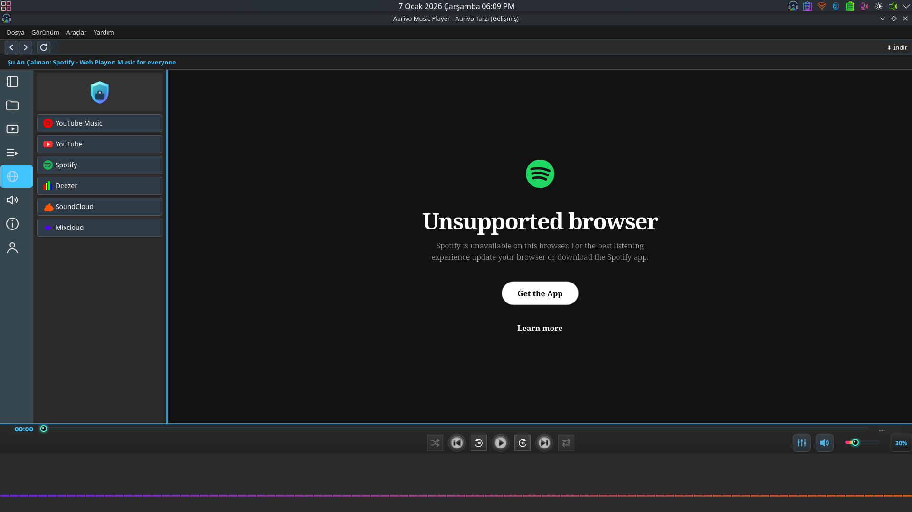

# 🎵 Aurivo Music Player

<div align="center">


**Güçlü, hafif ve görsel açıdan zengin müzik çalar**

**A powerful, lightweight, and visualization-rich music player**

[](../../releases)
[](LICENSE)
[](../../issues)
[](../../stargazers)

[](https://github.com)
[](https://python.org)
[](https://riverbankcomputing.com/software/pyqt/)

[📥 İndir / Download](../../releases) | [📖 Kurulum / Install](INSTALL.md) | [🐛 Hata / Bug](../../issues/new/choose) | [💡 Öneri / Feature](../../issues/new/choose) | [💬 Discussions / Tartışmalar](../../discussions)

</div>

---

## 📥 İndirme / Download

<div align="center">

[](../../releases/latest)

**Boyut:** ~205MB | **Platform:** Linux 64-bit

</div>

### 🎯 İçerik:
- ✅ Müzik/video oynatma (tüm formatlar)
- ✅ 11 görselleştirme modu (FFT analizi)
- ✅ 32-band EQ + yüzlerce preset
- ✅ DSP efektleri (C++ motoru)
- ✅ Manuel altyazı (.srt, .vtt)
- ✅ YouTube indirme
- ✅ Kütüphane yönetimi

### 🚀 Otomatik Altyazı (Opsiyonel)

Otomatik video altyazısı için Whisper AI'yi kurun:

```bash
pip install openai-whisper torch
```

**Özellikler:**
- 90+ dil otomatik transkripsiyon
- Gerçek zamanlı altyazı üretimi
- .srt/.vtt dışa aktarma

⚠️ Not: Whisper + PyTorch ~2GB ek alan gerektirir

---

## ⚠️ DİKKAT / WARNING

<div align="center">

### 🇹🇷 Türkçe
**Bu uygulama aktif geliştirme aşamasındadır!**

- Beklenmedik hatalar ve çökmeler yaşanabilir
- Bazı özellikler eksik veya dengesiz olabilir
- API ve yapı değişiklikleri beklenmelidir
- Üretim ortamında kullanım önerilmez
- Geri bildirimleriniz çok değerlidir!

---

### 🇬🇧 English
**This application is under active development!**

- Unexpected bugs and crashes may occur
- Some features may be incomplete or unstable
- API and structural changes should be expected
- Not recommended for production use
- Your feedback is highly appreciated!

</div>

---

## ✨ Özellikler

## ✨ Features

### 🎨 Görselleştirme
- **11 Farklı Mod**: Çizgiler, Daireler, Spektrum, Enerji Halkaları, Dalga, Pulsar, Spiral, Volcano, Işın, Çift Spektrum, Radyal Grid
- **Gerçek Zamanlı FFT Analizi**: NumPy tabanlı 96-band frekans spektrumu
- **Tam Ekran Desteği**: Ayrı pencerede veya ana ekran altında
- **Akıcı Bar Animasyonu**: Attack/release yumuşatma, cap heights

### 🎨 Visualizations
- **11 Modes**: Lines, Circles, Spectrum, Energy Rings, Wave, Pulsar, Spiral, Volcano, Beam, Dual Spectrum, Radial Grid
- **Real-time FFT**: NumPy-based 96-band spectrum
- **Fullscreen Support**: Separate window or embedded bar
- **Smooth Bars**: Attack/release smoothing with peak caps

### 🎛️ Ses İşleme
- **32 Bant Ana EQ + Hazır Ayarlar**: Yüzlerce preset, arama, seçili preset göstergesi
- **DSP Efektleri** (C++ motoru):
  - Compressor
  - Limiter
  - Exciter
  - Stereo Widener
  - Bass Boost
- **Crossfade**: Parçalar arası geçiş efekti

### 🎛️ Audio Processing
- **32-band EQ + Presets**: Hundreds of presets, search, selected preset indicator
- **DSP Effects** (C++ engine): Compressor, Limiter, Exciter, Stereo Widener, Bass Boost
- **Crossfade**: Smooth transitions between tracks

## 🆕 Yeni Sürüm (Aurivo)

Bu sürümde uygulama adı **Angolla → Aurivo** olarak yeniden markalandı.
- Paketleme/kurulum dosyaları ve launcher adı **aurivo** olacak şekilde güncellendi
- İkon seti **Aurivo** adıyla üretildi ve bağlandı
- Eski kullanıcı verileri için (playlist/config) geriye dönük taşıma mantığı korunur

## 🆕 New Release (Aurivo)

In this release, the app has been rebranded from **Angolla → Aurivo**.
- Packaging/install scripts and launcher name updated to **aurivo**
- Icon set generated and wired under the **Aurivo** name
- Backward compatibility kept for existing user data (playlist/config)

### 📚 Kütüphane Yönetimi
- **SQLite Veritabanı**: Hızlı tarama ve arama
- **Metadata Desteği**: ID3, MP4, FLAC, Vorbis
- **Sıralanabilir Tablo**: Başlık, sanatçı, albüm, süre
- **Playlist Koleksiyonları**: Çoklu playlist yönetimi

### 🎬 Video Desteği
- **Video Oynatma**: GStreamer tabanlı
- **Çoklu Dil Altyazı**: SRT, VTT formatları
- **Otomatik Transkripsiyon**: Whisper entegrasyonu (opsiyonel)
- **C++ Subtitle Engine**: pybind11 ile hızlı işleme

### 🎨 Tema Sistemi
- **7 Hazır Tema**: AURA Mavi, Gece Moru, Neon Yeşil, Gün Batımı, vb.
- **Bar Renk Modları**: Normal, RGB spektrum, Gradyan
- **Dinamik Renkler**: Tema değişimi ile otomatik uyum

## 📦 İndirme Seçenekleri

### 🎵 Aurivo Standard (Önerilen)
**Boyut**: ~150-200MB  
**İçerik**:
- ✅ Müzik çalma (tüm formatlar)
- ✅ Video oynatma
- ✅ Manuel altyazı (.srt, .vtt)
- ✅ 11 görselleştirme modu
- ✅ 10 bantlı ekolayzır
- ✅ DSP efektleri
- ✅ YouTube indirme
- ❌ Otomatik video altyazı (Whisper)

**Kimler için?**: Çoğu kullanıcı için yeterli

### 🎬 Aurivo Pro (Gelişmiş)
**Boyut**: ~2.5GB  
**İçerik**:
- ✅ Standard'daki tüm özellikler
- ✅ **Otomatik video transkripsiyon** (Whisper AI)
- ✅ Çoklu dil otomatik altyazı

**Kimler için?**: Video altyazı oluşturmak isteyenler

---

## 📦 Download Options

### 🎵 Aurivo Standard (Recommended)
**Size**: ~150-200MB  
**Features**:
- ✅ Music playback (all formats)
- ✅ Video playback
- ✅ Manual subtitles (.srt, .vtt)
- ✅ 11 visualization modes
- ✅ 10-band equalizer
- ✅ DSP effects
- ✅ YouTube download
- ❌ Automatic video subtitles (Whisper)

**Who is it for?**: Sufficient for most users

### 🎬 Aurivo Pro (Advanced)
**Size**: ~2.5GB  
**Features**:
- ✅ All Standard features
- ✅ **Automatic video transcription** (Whisper AI)
- ✅ Multi-language automatic subtitles

**Who is it for?**: Users who want to generate video subtitles

---

## 🚀 Hızlı Başlangıç

## 🚀 Quick Start

### İndirme ve Kurulum
```bash
# 1. Son sürümü indirin
wget https://github.com/muhammeddali1453-beep/Aurivo-Music-Player/releases/latest/download/Aurivo-Linux-v2.0.1.tar.gz

# 2. Sistem bağımlılıklarını kurun
sudo pacman -S gst-plugins-base gst-plugins-good gst-plugins-bad gst-libav  # Arch
# sudo apt install gstreamer1.0-plugins-* gstreamer1.0-libav  # Ubuntu

# 3. Paketi çıkartın
tar -xzf Aurivo-Linux-v2.0.1.tar.gz
cd aurivo

# 4. Çalıştırın
./aurivo
```

Detaylı kurulum talimatları için [INSTALL.md](INSTALL.md) dosyasına bakın.

For detailed installation instructions, see [INSTALL.md](INSTALL.md).

## 🚀 Try Aurivo & Give Feedback

### 🇹🇷 Türkçe
- Son sürümü indirin: [Releases](../../releases)
- Hata bildirin: [Issues (Yeni)](../../issues/new/choose)
- Özellik isteyin / fikir paylaşın: [Discussions](../../discussions)

### 🇬🇧 English
- Download the latest build: [Releases](../../releases)
- Report bugs: [Issues (New)](../../issues/new/choose)
- Request features / share ideas: [Discussions](../../discussions)

> Not / Note:
> Discussions kategorileri GitHub tarafından varsayılan olarak oluşturulur (General / Ideas / Q&A vb.).
> Bu repo’da önerilen kullanım:
> - 💡 Feature Requests / Özellik İstekleri → **Ideas**
> - 🐛 Bug Reports / Hata Raporları → **Issues**
> - 💬 General / Genel → **General**
> - 🙏 Q&A / Soru & Cevap → **Q&A**

## 📸 Ekran Görüntüleri / Screenshots

### Ana Arayüz
<div align="center">
  
  <p><em>Playlist yönetimi ve görselleştirme / Playlist management & visualization</em></p>
</div>

### Görselleştirme Modları
<div align="center">
  
  
  <p><em>11 farklı FFT tabanlı görselleştirme modu / 11 FFT-based visualization modes</em></p>
</div>

### Ekolayzır & Kütüphane
<div align="center">
  
  
  <p><em>10 bantlı EQ ve SQLite kütüphane yönetimi / EQ & SQLite-powered library</em></p>
</div>

### Tam Ekran & Video Desteği
<div align="center">
  
  
  <p><em>Tam ekran mod ve çoklu dil altyazı desteği / Fullscreen & multi-language subtitles</em></p>
</div>

### Ek Ekran Görüntüleri / Extra Screenshots
<div align="center">
  
  
  
</div>

## 🔮 Gelecek Özellikler / Future Plans

### 🇹🇷 Türkçe
- YouTube entegrasyonu
- Özel tema sistemi (custom themes)
- Yeni görselleştiriciler ve preset paketleri

### 🇬🇧 English
- YouTube integration
- Custom themes
- New visualizers and preset packs

## 💻 Teknik Detaylar

### Mimari
- **Tek Dosya Yapısı**: ~3000+ satır monolitik Python kodu
- **PyQt5 GUI**: QMainWindow, QMediaPlayer, QAudioProbe
- **C++ Bileşenler**:
  - `aurivo_dsp` (Linux: `.so`, Windows: `.dll`): Ses efektleri motoru
  - `subtitle_engine` (Linux: `.so`, Windows: `.pyd`): Altyazı işleme (pybind11)
- **FFT Pipeline**: QAudioProbe → NumPy → 96-band spektrum → Görselleştirme

### Ses Veri Akışı
```
QMediaPlayer → QAudioProbe → process_audio_buffer() 
  → FFT Analizi → send_visual_data() 
  → update_sound_data() (Yumuşatma) 
  → paintEvent() → Render
```

### Desteklenen Formatlar
- **Ses**: MP3, FLAC, OGG, M4A, WAV
- **Video**: MP4, MKV, AVI, WebM (GStreamer codec desteğine bağlı)
- **Altyazı**: SRT, VTT

## 🛠️ Kaynak Koddan Derleme

```bash
# 1. Repository'yi klonlayın
git clone https://github.com/KULLANICI_ADI/Aurivo-Music-Player.git
cd Aurivo-Music-Player

# 2. Python bağımlılıklarını kurun
pip install PyQt5 mutagen numpy soundfile Pillow

# 3. C++ modüllerini derleyin
python setup.py build_ext --inplace

# 4. Linux paketi oluşturun
./build_linux.sh

# 5. Dağıtım arşivi oluşturun
./package_linux.sh
```

Detaylar için [DISTRIBUTION.md](DISTRIBUTION.md) dosyasına bakın.

## 📋 Sistem Gereksinimleri

| Bileşen | Minimum | Önerilen |
|---------|---------|----------|
| OS | Linux (kernel 5.0+) | Linux (kernel 6.0+) |
| RAM | 512 MB | 1 GB |
| Disk | 250 MB | 300 MB |
| CPU | Dual-core 1.5 GHz | Quad-core 2.0 GHz |
| GPU | OpenGL 2.0 | OpenGL 3.0+ |

## 🤝 Katkıda Bulunma

Katkılarınızı bekliyoruz! Pull request göndermeden önce:

1. Fork edin ve branch oluşturun
2. Değişikliklerinizi test edin
3. Türkçe kod yorumları ekleyin
4. Pull request açın

Detaylar için [CONTRIBUTING.md](CONTRIBUTING.md) dosyasına bakın.

## 📝 Lisans

### 🇹🇷 Türkçe
Bu proje **proprietary** lisansla dağıtılır. Kaynak kodun kopyalanması/dağıtılması/değiştirilmesi lisans kapsamında kısıtlanmıştır.
Detaylar için [LICENSE](LICENSE) dosyasına bakın.

### 🇬🇧 English
This project is distributed under a **proprietary** license. Copying/distributing/modifying the source code is restricted by the license terms.
See [LICENSE](LICENSE) for details.

## 🐛 Hata Bildirimi

Hata bulduysanız veya özellik önerisi yapmak istiyorsanız:
- [GitHub Issues](../../issues) üzerinden hata bildirin
- Terminal çıktısını ekleyin (`./aurivo` ile çalıştırın)
- Sistem bilgilerinizi paylaşın (distro, Python versiyonu)

## 🙏 Teşekkürler

- **PyQt5**: GUI framework
- **NumPy**: FFT analizi
- **GStreamer**: Multimedia pipeline
- **Whisper**: Otomatik transkripsiyon

---

<div align="center">

**Aurivo ile müziğinizin tadını çıkarın! 🎶**

[⬆ Başa Dön](#-aurivo-music-player)

</div>
